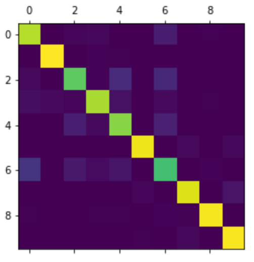

# Deel 3 - opgaveset 1

In deze opgave gaan we op basis van de test-data bepalen hoe goed [ons eerder getrainde netwerk](../week4/opgave2-3.md) is. Zoals bekend is de accuratesse op zich niet voldoende om de presentatie van een classifier te bepalen: wanneer je gewoon zou gokken heb je bij tien mogelijke categorieën al een score van tien procent, en als je zou gokken dat een sample iets *niet* is, is de accuratesse al negentig procent. Betere metrieken hiervoor worden gegeven door de *confusion matrix*, die tijdens de theorieles besproken is. 

### Opgave 1a: bepalen van de confusion matrix

Maak de methode `confMatrix()` af. Zoals je ziet krijgt deze methode twee parameters mee, namelijk de door het netwerk voorspelde waarden, en de daadwerkelijke waarden. Maak gebruik van de methode <a href="https://www.tensorflow.org/api_docs/python/tf/math/confusion_matrix">`confusion_matrix` in TensorFlow</a> om deze matrix te bepalen. Retourneer de matrix.

Als je hiermee klaar bent, wordt de methode door het script `exercise3.py` aangeroepen, met de voorspellingen van de `test_images` en actuele waarden van die test-data (`test_labels`). Het resultaat wordt vervolgens in een plot weergegeven; als het goed is, ziet het er ongeveer als volgt uit: 

### Opgave 1b: TP, TN, FP, FN
Om meer metrieken uit het getrainde model te halen, volstaat niet alleen het percentage van de samples dat correct is geclassificeerd; we moeten dan ook weten welk percentage terecht als *niet* van een bepaalde klasse is geclassificeerd, welke onterecht als *wel* van een bepaalde klasse, en welk percentage onterecht als *wel* van een bepaalde klasse: de zogenaamde *true positives*, *true negatives*, *false positives* en *false negatives* (zoals in het theoriecollege besproken is).

De methode `confEls()` in `uitwerkingen.py` krijgt als parameter een numpy-array mee, die ook ten grondslag ligt aan de afbeelding hierboven. De *regels* van deze matrix corresponderen met de *werkelijke* waarde van het sample, de *kolommen* van deze matrix corresponderen met de *voorspelling* van het sample door het model. Hoewel er semantisch wel het één en ander op aan te merken is, definiëren we de hierboven beschreven metrieken als volgt:

- $tp_{i} = c_{ii}$

- $fp_{i} = \sum_{l=1}^n c_{li} - tp_{i}$

- $fn_{i} = \sum_{l=1}^n c_{il} - tp_{i}$

- $tn_{i} = \sum_{l=1}^n \sum_{k=1}^n c_{lk} -tp_{i} - fp_{i} - fn_{i}$

Hierbij is $i$ de categorie in kwestie (dus in dit specifieke geval loopt die van 1 - 10). 

Implementeer de methode `confEls()`, en retourneer een lijst met deze vier metrieken voor elk label – bestudeer het reeds gegeven deel van de implementatie om een beeld te krijgen van de exacte vorm van de return-waarde.

## Opgave 1c: precision en recall

Implementeer nu de methode `confData()`, waarin je de data die je in de vorige opgave hebt gemaakt omzet in de onderstaande metrieken: 

- $sensitivity (TPR) = \frac{tp}{tp + fn}$

- $precision (PPV) = \frac{tp}{tp + fp}$

- $specificity (TNR) = \frac{tn}{tn + fp}$

- $fall-out (FPR) = \frac{fp}{fp + tn}$

Deze methode krijgt de lijst uit de vorige opgave mee: de totale $tp$ is dan de som van alle $tp$'s van alle labels – en vergelijkbare berekeningen voor de total $tn$, $fp$ en $fn$. Retourneer deze data als een dictionary. Als je deze beide methoden hebt geïmplementeerd, kun je het script `exercise3.py` nogmaals runnen; Hierdoor worden deze waarden afgedrukt. Zeg op basis van deze resultaten iets over de kwaliteit van het uitgeprogrammeerde netwerk.
